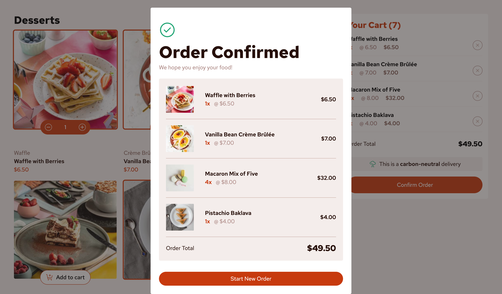
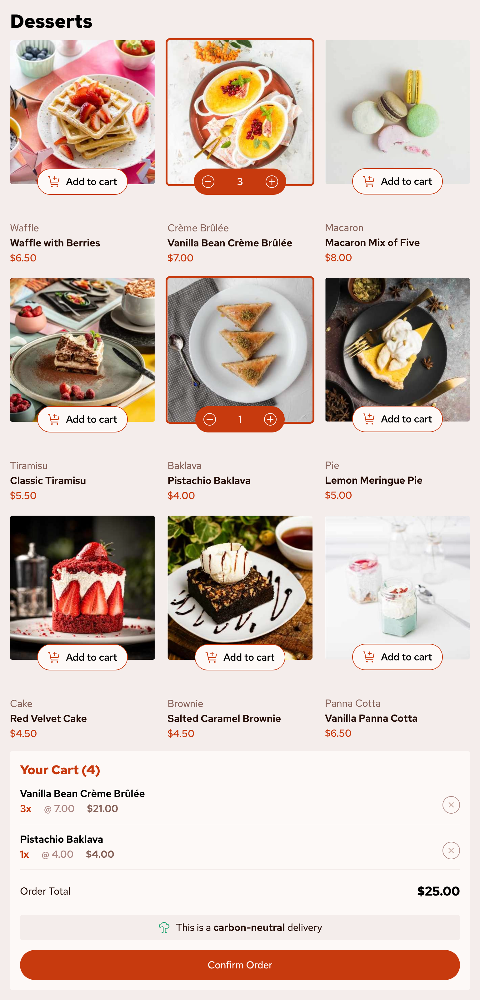
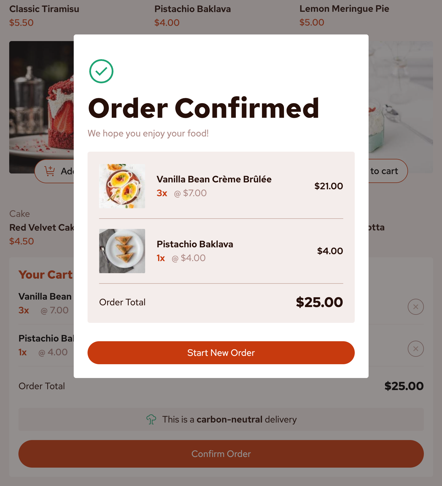
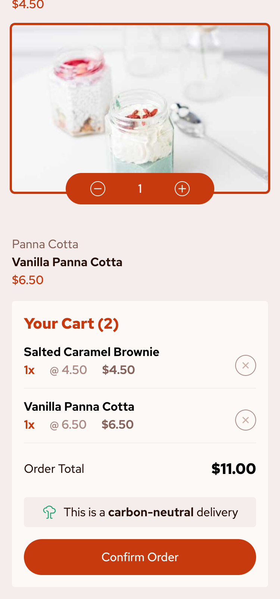
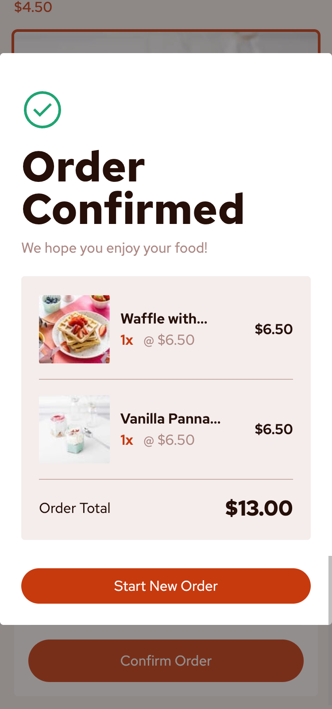

# Frontend Mentor - Product list with cart solution

This is a solution to the [Product list with cart challenge on Frontend Mentor](https://www.frontendmentor.io/challenges/product-list-with-cart-5MmqLVAp_d). 


## Table of contents

- [Overview](#overview)
  - [The challenge](#the-challenge)
  - [Screenshot](#screenshot)
- [My process](#my-process)
  - [Built with](#built-with)
  - [What I learned](#what-i-learned)
  - [Issues Still to Fix](#issues-still-to-fix)

## Overview

### The challenge

Users should be able to:

- Add items to the cart and remove them
- Increase/decrease the number of items in the cart
- See an order confirmation modal when they click "Confirm Order"
- Reset their selections when they click "Start New Order"
- View the optimal layout for the interface depending on their device's screen size
- See hover and focus states for all interactive elements on the page


#### Additional feature 🚀
- Click outside of "Order Confirmation" modal box to edit current shopping cart

### Screenshot

#### Desktop 1044px

|     <a href="screenshots/Desktop1440.png"></a>   |
| ---------------------------------------------- |
|     <a href="screenshots/Desktop1440-modal.png"></a> |

#### Tablet 768px
|     <a href="screenshots/Tablet768.png"></a>   |
| ---------------------------------------------- |
|     <a href="screenshots/Tablet768-modal.png"></a> |

#### Mobile 375px
|     <a href="screenshots/Mobile375-half.png"></a>   |
| ---------------------------------------------- |
|     <a href="screenshots/Mobile375-modal.png"></a>  |


## My process

### Built with

- Semantic HTML5 markup
- CSS custom properties
- Flexbox
- CSS Grid
- Mobile-first workflow
- [React](https://reactjs.org/) - JS library
- [Tailwind CSS](https://tailwindcss.com/docs/installation/using-vite)

### What I learned

1. Adding Custom Colors in Tailwind

To define and use custom colors in Tailwind, add them in `index.css`:

```css
/* in index.css */
@theme {
  --color-custom-red: #c73a0f;
}
```

Then, reference them in JSX:

```jsx
<p className="text-custom-red"></p>
```

2. Using Pseudo Classes

Apply pseudo-classes like `hover` to dynamically change styles:

```jsx
<button className="hover:bg-custom-red"></button>
```

3. Using Custom CSS Variables for Filters

Define a CSS variable for a filter effect in `index.css`:

```css
/* in index.css */
:root {
  --red-filter: invert(22%) sepia(10%) saturate(30000%) hue-rotate(320deg)
    brightness(80%) contrast(108%);
}
```

Then, apply it in JSX:

```jsx
// in Product.jsx

```

4. Adding a Modal

To create a simple modal, structure it with three essential divs:

- [YouTube Tutorial](https://www.youtube.com/watch?v=9DwGahSqcEc)
- [GitHub Repository](https://github.com/ecole-du-web/react-modal)

<strong>HTML Structure</strong>

```html
<div class="modal">
  <div class="overlay">
    <div class="content">
      <p>Some content here</p>
    </div>
  </div>
</div>
```

<strong>Basic CSS Styling</strong>

```css
.modal, .overlay {
  /* Ensure it covers the entire viewport */
  width: 100vw;
  height: 100vh;
  position: fixed;
  top: 0;
  left: 0;
  right: 0;
  bottom: 0;
}

.overlay {
  background: rgba(49, 49, 49, 0.8);
}
```

5. Learning React

For learning React, I found this course useful: https://scrimba.com/learn-react-c0e


6. Deploying a Vite App to GitHub Pages

To deploy a Vite app to GitHub Pages, refer to the following guide: https://github.com/ErickKS/vite-deploy

7. Paths when deploying to github-pages

Here is an example directory structure:

```
.
├── src/
│   ├── components/
│   │   ├── Modal.jsx
│   │   └── OrderItem.jsx
│   └── ...
├── public/
│   ├── image-waffle-thumbnail.jpg
│   ├── icon-order-confirmed.svg
│   └── ...
├── data.json
└── ...
```

### i) Paths in a `.jsx` File

#### When referencing from a `.jsx` file located in `/src/components/`

##### Importing an image from `/public`
```jsx
import orderConfirmIcon from "/icon-order-confirmed.svg";
```

##### Importing another component from the same subdirectory
```jsx
import OrderItem from "/src/components/OrderItem.jsx";
```

### ii) Paths in `data.json`

#### When referencing from `data.json` located in the root directory (`/data.json`)

##### Referencing an image Located in `/public`
```json
{
  "thumbnail": "./image-waffle-thumbnail.jpg"
}
```


### Issues Still to Fix
1. The `+` and `-` button images (underneath the product) only change color when hovering over the `img`, but not when hovering over the `div` containing the `img`.
1. The same issue occurs with the `x` icon next to each cart item.

